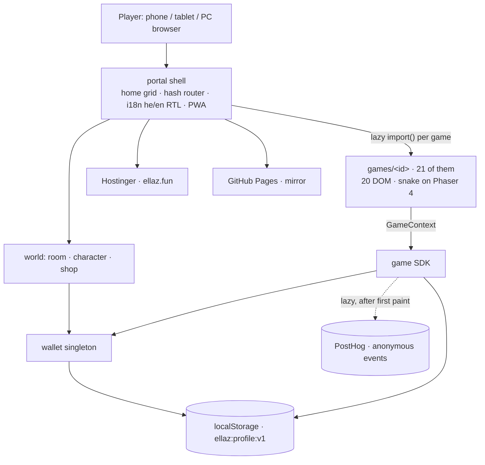

# Ellaz Architecture

Ellaz is a cross-device casual-games **PWA**: one website, 21 small games,
playable on phone, tablet, and PC with touch, mouse, or keyboard. Hebrew
(default, RTL) + English (LTR). Anonymous play, on-device saves, anonymous
kid-safe analytics.

**"No backend" is no longer strictly true, and the distinction matters.** There
is still no server the app talks to in order to be playable — every game runs
offline against `localStorage`, and that is not changing. A Firebase project
exists (`ellaz-games`, Firestore in me-west1) to back anonymous players and
leaderboards. Gameplay must never depend on it: if Firestore is unreachable, or
its free daily quota is spent, a child plays exactly as before and sees a stale
board rather than an error.

## System diagram



## Module layout

Single Vite app; internal modules mirror extractable packages 1:1 (imported via
the `@sdk` / `@ui` / `@juice` / `@i18n` / `@shared` aliases, never deep paths).

Two other workspaces share the repository and none of this table: `holdem/`
(the poker table, [`docs/poker-table.md`](poker-table.md)) and, since
2026-09-05, `studio/` - the art bible: style renderers with recipes, rigged
characters, a sprite export (sheet + atlas + manifest) with Phaser and canvas
adapters, and a gallery (shadcn on the ellaz tokens, port 5188, built to one file). Each has its own `package.json`, tests and
workflow; nothing in `src/` imports from either and nothing in them imports
from `src/`, and root `npm test` runs none of their tests. The studio's map is
[`studio/README.md`](../studio/README.md); its rules for what every style must
agree with are [`studio/docs/art-bible.md`](../studio/docs/art-bible.md).

The app's own modules:

| Module | Responsibility |
|--------|----------------|
| `src/sdk` | The neutral **GameModule / GameContext** contract: `SaveStore`, analytics, audio, speech, lifecycle, ads stubs, plus the three policy modules below |
| `src/sdk/economy.ts` | The **only** place a reward amount is decided |
| `src/sdk/score.ts` | The **only** place a ranking direction is decided |
| `src/sdk/session.ts` | The **only** place it is decided whether a stored position is still safe to load |
| `src/shared` | Neutral game helpers — seeded rng, pentatonic notes, `winMoment()` (the canonical win), `useGameTimer`, and the two persistence hooks (`useRememberedLevel`, `useGameSession`) |
| `src/ui` | Design tokens + RTL-aware components + `DifficultySelector` + `gameArtView` (a game's key art with the emoji fallback, shared by the home grid and the boards so there is one answer to what a game looks like) |
| `src/juice` | Game-feel kit — haptics, shake, particle burst, confetti, `flyTo`, tween |
| `src/i18n` | he (RTL) + en (LTR) strings + direction |
| `src/portal` | Shell: `App` (the home screen at `/`), `Home` (grid), `PageApp` (boots a game or a room/boards screen on its own page), `GameHost` (mount bridge), `catalog` (registry + lazy loaders), `Boards` + `boardsView` (the leaderboards and their pure half), `world/` (room + shop). **The hash router is retired** — every route is a real URL |
| `src/build` | **BUILD-TIME ONLY** — the 164 emitted documents. `routes.ts` is the route table and the single source of truth for what a page IS (`PageKind` = home · game · category · world · boards · notFound); `pages.ts`, `gamePage.ts`, `sitePages.ts`, `layout.ts` render them; `siteFiles.ts` writes robots/sitemap/llms; `ogCard.ts` + `ogImages.ts` rasterise the share cards. Reads `src/content`, and **nothing in the app may import it**. Anything answering "which page is this" keys on the route table — see `.claude/rules/a-proxy-for-a-page-kind-stops-discriminating-when-the-type-grows.md` |
| `src/games/<id>` | `logic.ts` (pure, TDD) + `logic.test.ts` + a DOM (React) or canvas (Phaser) renderer |
| `src/report` | Player bug and idea reports. `context.ts` captures the moment from an injected env (an ALLOWLIST of named keys - it can never see the backup code); `shot.ts` refuses a blank canvas frame rather than shipping a black rectangle; `send.ts` writes one Firestore document over plain `fetch`; `outcome.ts` decides what the player is told; `ReportSheet.tsx` is the sheet, in its own lazy `report-*` chunk. Nothing reads a report from a browser - `firestore.rules` is `create`-only. Runbook: [`docs/reports.md`](reports.md) |

## The SDK contract

Games never touch portal internals — only `GameContext`. Its lifecycle + ads
shape matches the **Poki + CrazyGames** union, so games can list on those
portals later with no rewrites.

```ts
interface GameContext {
  mount: HTMLElement; locale; dir; t;
  storage: SaveStore;                 // gameId-scoped, incognito-safe
  analytics: AnalyticsPort;           // anonymous, kid-safe (never identify())
  audio: AudioPort;                   // WebAudio synth; unlock() on first gesture
  speech: SpeechPort;                 // Web Speech TTS; ALWAYS supplementary
  rewards: RewardsPort;               // grant() only — no spend()
  score: ScorePort;                   // report()/best() only — no clear()
  session: SessionPort;               // where they left off; load() answers
                                      // undefined for anything untrustworthy
  lifecycle: { loadingStart/Finished; gameplayStart/Stop };
  ads: { interstitial(); rewarded() };// no-op stubs in v1
  onRequestExit; onPause; onResume; onResize;
}
```

### The two add-only ports, and why they are shaped that way

`RewardsPort` has no `spend()` and `ScorePort` has no `clear()`. A game can only
ever put value in. Spending happens in exactly one place — the World screen,
against the `wallet` singleton — so no game, and no bug in a game, can take a
child's coins or delete their record.

Neither port lets a game state its own terms. `grant()` takes a **reason**, not
an amount. `report()` takes a **unit**, not a direction. Both exist so that ~30
games cannot each invent their own economics or their own idea of which way a
leaderboard sorts. Tuning either is a one-file change.

Details: [`rewards-economy-convention.md`](../.claude/rules/rewards-economy-convention.md)
· [`score-contract-convention.md`](../.claude/rules/score-contract-convention.md).

### The third policy port: where the player left off

`SessionPort` is the same shape one step further out. A game reports **where it
is**; `session.ts` alone decides whether a stored position is still usable —
version, age, byte cap, and the game's own shape check, every one of them
failing to `undefined`, which is the same answer as "never played". So a game
needs one code path for a corrupt snapshot and a first-ever visit.

It exists as a port for the reason the other two do: a wrong answer here does
not throw. It renders a plausible board that the game's own rules can no longer
explain.

Two things a snapshot carries that are not the board, and both are load-bearing:
every **latch recording a reward the run already collected** (2048's `won` and
`bestFired`, blocks' milestone step) — without them, leaving a game is a way to
be paid twice — and, for a timed game, the **clock**, or every abandoned board
becomes a personal best nobody earned.

Sessions are device-local by construction: `ellaz:<gameId>:session` cannot match
the anchored `ellaz:<game>:score:<board>` pattern `records.ts` validates, so a
cloud restore moves coins and records and never a board mid-play.

Details: [`session-snapshot-convention.md`](../.claude/rules/session-snapshot-convention.md).

## Rendering split

- **React DOM** — 21 of 22 games. Free accessibility, text, responsive layout,
  trivial input.
- **Phaser 4** — snake, and only snake. `grep -rln 'from "phaser"' src/` returns
  one file, `games/snake/SnakeScene.ts` (re-verified 2026-08-09, when `blocks`
  shipped as DOM rather than canvas). Its 379 KB is a lazy, precache-excluded
  chunk, so it costs a first-time visitor nothing — but the older claim that it
  is "paid once and shared across all canvas games" was never true.

Each game is lazy-loaded via `import()` so only the code you play is downloaded.
The engine question is settled and re-litigating it is explicitly discouraged —
see [`engine-tournament/EYEBALL-VERDICT.md`](engine-tournament/EYEBALL-VERDICT.md),
including the published claim in it that turned out to be false.

## Cross-device rules

- **Input:** Pointer Events only (`pointerdown/move/up` + `setPointerCapture`);
  `touch-action: none` on play surfaces; `keydown` state map for desktop.
- **Sizing:** boards use `min(<vw>, <vh>, <cap>px)` so they fit portrait,
  landscape, and tablet. `GameHost`'s mount is a scroll container with
  `minHeight: 0` (flexbox scroll trap) — tall games scroll, never clip.
- **Kids games:** **tap-completable; drag optional, never required.** Plus
  ≥2×2cm targets, icon+audio navigation, instant restart, no fail-punishment.
- **RTL:** a spatial grid carries `dir="ltr"` so it does not mirror inside the
  Hebrew app — otherwise swipe and arrow directions invert.

## Analytics

Anonymous, kid-safe (COPPA internal-operations): PostHog **anonymous-events mode
only** — never `identify()`, no PII, no session replay, no autocapture, no
behavioral ads. Analytics failure must never block gameplay. Loaded lazily after
first paint behind a bounded queue; a failed import drops events silently.

**It is currently inert** — `VITE_POSTHOG_KEY` is unset, so the init is
dead-code-eliminated at build time. See [`build-log.md`](build-log.md).

## Performance

**First visit: 69,624 B gz**, measured on the live artifact 2026-08-02 (down
from 143,234). Each game is a ~3.5 KB chunk. Phaser and PostHog are lazy and
precache-excluded.

**Adding a chunk is three coordinated changes** — the dynamic `import()`, a
*named* `manualChunks` branch, and a `globIgnores` entry — and a fourth if the
import sits at module scope, where it must be behind the same guard as its
route. `npm run build:check` enforces both first-visit paths. See
[`precache-glob-sweeps-new-chunks.md`](../.claude/rules/precache-glob-sweeps-new-chunks.md).

## Add a game

See "Add a new game (~30 min)" in [`CLAUDE.md`](../CLAUDE.md).

## Known traps

- **Nested React-root teardown** — defer via `queueMicrotask`
  ([rule](../.claude/rules/react-nested-root-teardown.md)).
- **The service worker serves a stale bundle during QA** — use `npm run dev`
  ([rule](../.claude/rules/pwa-stale-bundle-qa.md)).
- **A green deploy is not a changed site** — read the upload step's conclusion,
  then the live asset hash
  ([rule](../.claude/rules/verify-the-deploy-target-not-just-the-run.md)).
- **A fixed 60 Hz simulation step freezes every second frame on a 120 Hz
  display** — preventive; no current game is exposed
  ([rule](../.claude/rules/fixed-timestep-must-match-display.md)).
- **Clearing browser storage erases the child's coins, stars and room**, and a
  phone and a tablet are two separate players. There is no recovery. This is
  what Wave C addresses.
